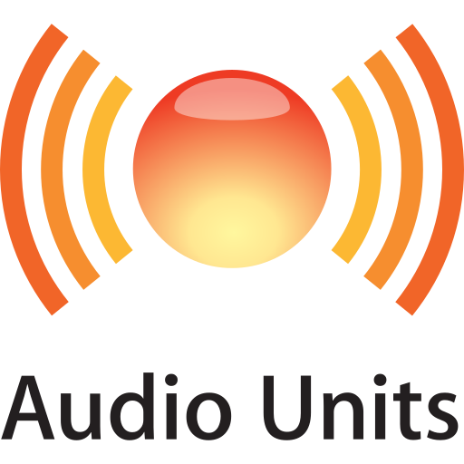
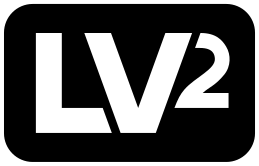

AURA learns the spectrum of one signal and of a reference, and
builds a linear-phase EQ curve that tries to replicate the audio signature of the reference to the current signal.


---

## Controls

| |                                                                                       |
|---|---------------------------------------------------------------------------------------|
| **Amount** | how much of the correction to apply, −100 % to +100 %                                 |
| **Smoothing** | width of the fractional-octave window the curve is smoothed over                      |
| **L/R Link** | 100 % gives both channels the averaged curve, 0 % corrects each channel independently |
| **Low** / **High** | the band the correction is confined to, with a smooth roll-off at each edge           |
| **Output** | post-EQ trim, taken out along with the EQ when bypassed                               |


---

## Formats

Built as **VST3®**, **AU** (macOS), **LV2** and **CLAP**, on Windows, macOS, and
Linux.

Nothing is code-signed, so Gatekeeper and SmartScreen will warn on first run.

<p>
  <picture>
    <source media="(prefers-color-scheme: dark)" srcset="docs/logos/VST.png">
    
  </picture>
  &nbsp;&nbsp;&nbsp;&nbsp;&nbsp;&nbsp;&nbsp;&nbsp;
  <picture>
    <source media="(prefers-color-scheme: dark)" srcset="docs/logos/AU-onwhite.svg">
    
  </picture>
  &nbsp;&nbsp;&nbsp;&nbsp;&nbsp;&nbsp;&nbsp;&nbsp;
  <picture>
    <source media="(prefers-color-scheme: dark)" srcset="docs/logos/CLAP-white.png">
    
  </picture>
  &nbsp;&nbsp;&nbsp;&nbsp;&nbsp;&nbsp;&nbsp;&nbsp;
  <picture>
    <source media="(prefers-color-scheme: dark)" srcset="docs/logos/lv2_white.svg">
    
  </picture>
</p>

---

## Built on

[JUCE](https://juce.com) 9, with the build system derived from
[Pamplejuce](https://github.com/sudara/pamplejuce). CLAP support comes from
[clap-juce-extensions](https://github.com/free-audio/clap-juce-extensions).

---

## Building

Needs **CMake 3.25** or newer and a **C++23** compiler.

The submodules are not optional — JUCE, the shared CMake modules, and the CLAP
wrapper all live in them, and one has submodules of its own:

```bash
git clone --recursive https://github.com/Celine-audio/Aura.git
```

If you already cloned without `--recursive`:

```bash
git submodule update --init --recursive
```

Then:

```bash
cmake -B Builds -DCMAKE_BUILD_TYPE=Release
cmake --build Builds
```

Add `-G Ninja` if you have it. On macOS, `-DCMAKE_OSX_ARCHITECTURES="arm64;x86_64"`
builds a universal binary.

To run the tests:

```bash
ctest --test-dir Builds --output-on-failure
```

That covers the benchmarks too, since both targets are registered with CTest.

---

## Disclaimer

This software is provided "as is", without warranty of any kind. No liability can be claimed for any harm or damage caused by its use.

While this tool aims to do spectral matching to the best of its abilities, AURA makes no guarantee regarding the accuracy of its analysis or the musicality of the curves it derives.

---

## Licence and credits

AURA being free open-source software using the [JUCE](https://juce.com)
framework, and using its free licence, it inherits its AGPLv3 terms.
AURA is then under the [GNU AGPL v3](COPYING) licence. The full notices are in
[`LICENSE`](LICENSE) and [`THIRD-PARTY-NOTICES`](THIRD-PARTY-NOTICES).

<p>
  
</p>

### What that means in practice

Using AURA costs nothing and obliges nothing. The licence governs the distribution *of the software*.
The audio you process through it, and the curves and impulse responses you export are your own work.
You are able to fork this repo and modify it, provided you do so under the AGPLv3 licence and respect its conditions.

### Credits

- Build system and CI derived from [Pamplejuce](https://github.com/sudara/pamplejuce),
  © 2022 Sudara Williams, MIT
- Icons from [Font Awesome Free](https://fontawesome.com), © Fonticons, Inc.,
  used under [CC BY 4.0](https://creativecommons.org/licenses/by/4.0/)
- Typeface [Jura](https://github.com/ossobuffo/jura), by Daniel Johnson with
  Alexei Vanyashin and Mirko Velimirovic, under the SIL OFL 1.1
- Typeface [JetBrains Mono](https://github.com/JetBrains/JetBrainsMono),
  © 2020 The JetBrains Mono Project Authors, under the SIL OFL 1.1
- Typeface [Nico Moji](https://fonts.google.com/specimen/Nico+Moji),
  © 2016 The Nico Moji Project Authors, under the SIL OFL 1.1 — the wordmark
- VST® is a registered trademark of Steinberg Media Technologies GmbH

### AI disclosure
AURA contains no AI whatsoever. However, AI assistants were used alongside the authors during development; AURA remains the authors' work.
